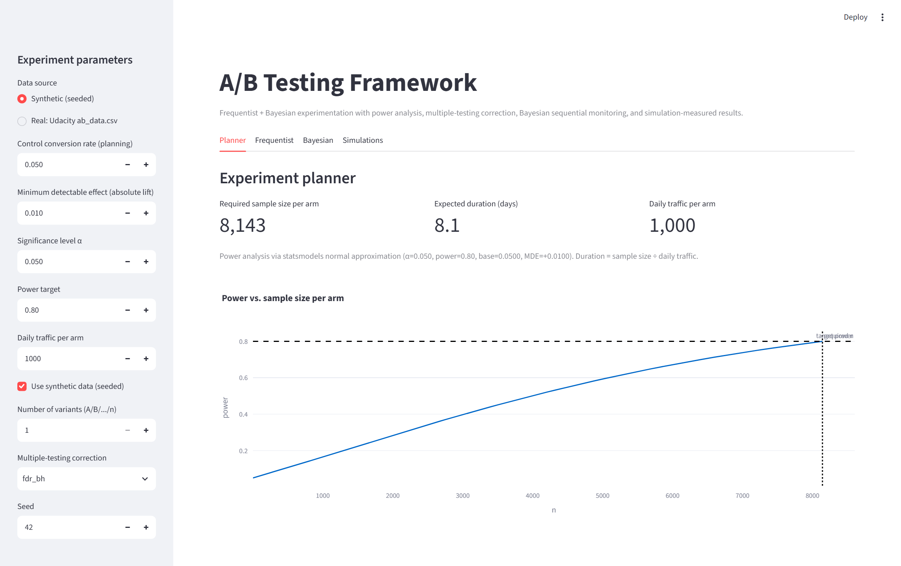
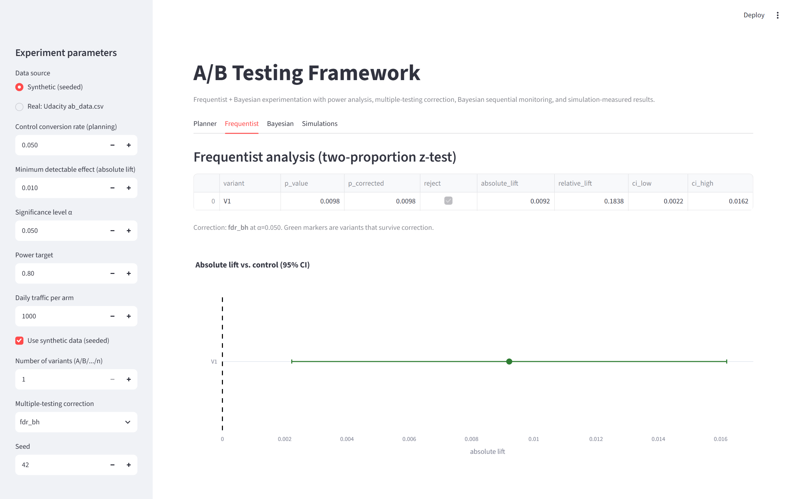
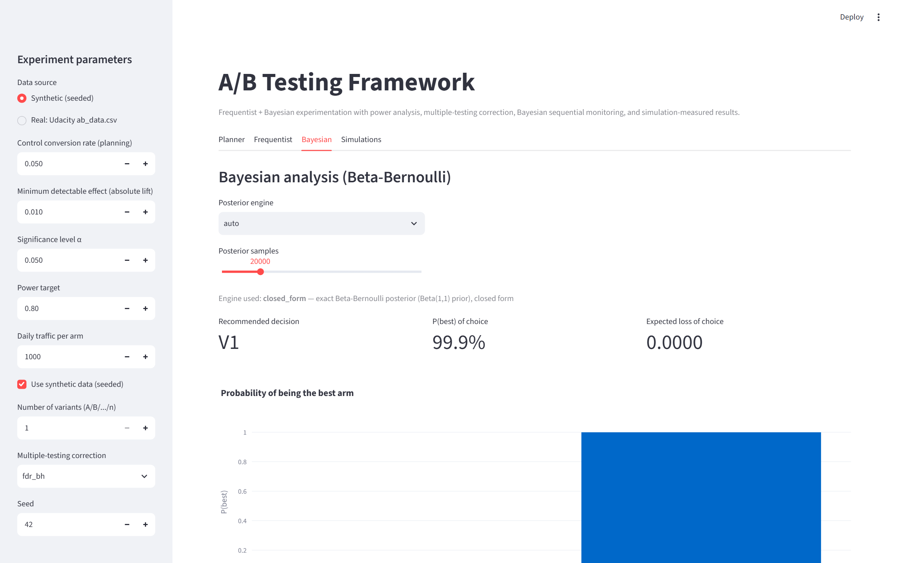
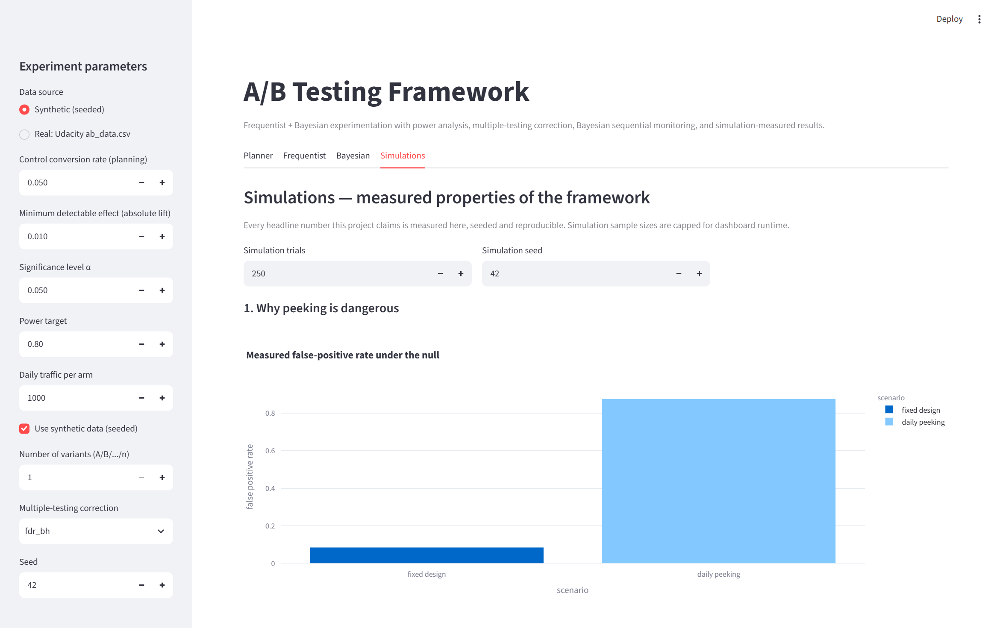
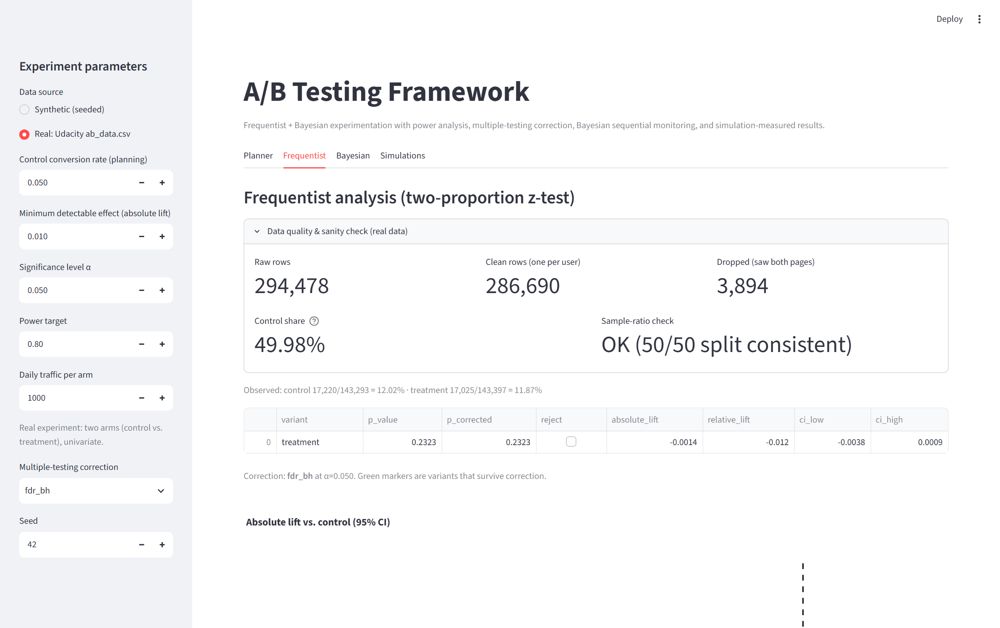

# A/B Testing Framework

An experimentation framework for **binary conversion metrics** that does A/B
testing the right way: proper power analysis, controlled false-positive rates,
multiple-testing correction, and Bayesian decision-making with early stopping.

Built to fix the three classic A/B testing mistakes:

> Peeking at results early → inflates false positives.
> Underpowered samples → real effects go undetected.
> No multiple-testing correction → lucky variants get shipped.

## What's inside

| Component | Technology | Purpose |
|---|---|---|
| Frequentist | SciPy / statsmodels | Two-proportion z-test, confidence intervals, multiple-testing correction (Bonferroni, BH) |
| Bayesian | PyMC *(with exact Beta fallback)* | Posterior distributions, P(best), expected loss |
| Power Analysis | Statsmodels | Sample-size calculation, power curves |
| Visualization | Matplotlib / Plotly | Posterior plots, forest plots, power curves |
| Dashboard | Streamlit | Interactive experiment planning and analysis |
| Simulations | NumPy / SciPy | *Measures* the framework's actual false-positive rate, power, and time-to-decision |

> **Note:** the spec originally said "PyMC3"; that package is deprecated and
> renamed. This framework uses **PyMC**, and falls back to exact closed-form
> Beta-Bernoulli sampling when PyMC isn't installed — so the dashboard always
> runs, even before the (heavy) PyMC install.

## Quickstart

```bash
python -m venv .venv
.venv\Scripts\activate            # Windows  (Unix: source .venv/bin/activate)
pip install -r requirements.txt
pytest                            # run the test suite
streamlit run dashboard/app.py    # launch the dashboard
```

## Dashboard

Launch it with `streamlit run dashboard/app.py`. The sidebar drives the whole
app (data source, traffic, base rate, MDE, α, power, variant count); the four
tabs below are all computed live from `abtest/` — no placeholder numbers.

**Planner** — required sample size, power curve, expected duration



**Frequentist** — z-tests, multiple-testing corrections, lift forest plot



**Bayesian** — posterior densities, P(best), expected loss, sequential monitor



**Simulations** — the four measured simulations with interactive parameters



With **data source = Real: Udacity `ab_data.csv`** the Frequentist tab also
shows the data-quality block — raw vs. clean row counts and the
sample-ratio-mismatch verdict — on the real experiment (a null result: the
framework says *keep control*, do not ship):



## Framework workflow

1. **Plan** — pick a base rate and minimum detectable effect (MDE); get the
   required sample size per arm, power curve, and expected test duration.
2. **Run** — collect conversions per arm (or generate synthetic data).
3. **Analyze** — frequentist (z-test, CIs, Bonferroni/BH-corrected decisions)
   *and* Bayesian (posterior, P(best), expected loss) side by side.
4. **Stop** — use the Bayesian sequential tracking chart: stop early when the
   evidence is decisive; otherwise run to the pre-planned sample size.
5. **Report** — fill in `docs/executive_template.md`.

## Architecture

```
abtest/
├── data_generator.py    seeded synthetic conversion data with known truth
├── real_data.py         real Udacity e-commerce A/B data: load, clean, SRM check
├── frequentist.py       two-proportion z-test, lift CIs
├── power.py             sample size, power curves, duration
├── multiple_testing.py  Bonferroni + Benjamini-Hochberg
├── bayesian.py          posteriors, P(best), expected loss
├── sequential.py        Bayesian early stopping
└── simulations.py       peeking / power / multi-test / time-to-decision sims
```

The dashboard runs on either dataset (sidebar toggle): seeded synthetic data,
or the **real Udacity e-commerce A/B test** committed in `data/ab_data.csv`
(~294k logged pageviews, ~290k unique users, Jan 2017). When it's the real
data you get an extra *data quality* block (sample-ratio-mismatch check) and
the Bayesian sequential monitor replays the experiment in actual arrival order.

## Real-world validation

Results of running the framework on the committed real dataset
(`data/ab_data.csv`, a real test of a new landing page vs. the old one):

| Metric | Value |
|---|---|
| Raw rows → clean rows | 294,478 → 286,690 (3,894 users saw both pages, dropped) |
| SRM / randomization check | control share 49.98% (95% CI [49.8%, 50.2%]) — passes |
| Control vs. treatment conversion | 12.02% vs. 11.87% |
| z-test (two-sided) | z = −1.19, **p = 0.23 — null result** |
| 95% CI on lift | [−0.38 pp, +0.09 pp] — straddles zero |
| Bayesian | P(control best) ≈ 1.0 → expected loss of shipping treatment ≈ 0.14 pp |
| Decision the framework makes | **Keep control** (or run longer) — do not ship |

This is the honest case experiments usually hit: the treatment is not
significant, and the framework says *don't ship* instead of manufacturing a
winner.

Every headline property this project claims is **measured by
`abtest/simulations.py`** (seeded, reproducible), not asserted. Measured with
the defaults (`seed=42`; bump the sidebar sim params to re-run):

| Experiments with smarts | Naive approach | Measured here |
|---|---|---|
| False-positive rate, planned design | Peeking at results daily | **4.2%** vs **93.1%** (1,000 null trials, 5k/arm, peek every 100) |
| Power at recommended sample size | Underpowered samples | **79.7%** measured at n=8,143/arm (target 80%) |
| Multiple-testing correction (Bonferroni / BH) | Ignored | "any false positive" across 20 null variants: **41.8% raw → 4.2% / 4.8%** |
| Bayesian sequential early stopping | Fixed 4-week wait | **88% faster** decisions (981 vs 8,143 users/arm), all trials stopped early |

The four sims, all seeded and in `abtest/simulations.py`:

- `simulate_peeking` — false-positive rate when peeking at true-null tests vs.
  a fixed design
- `simulate_power` — realized power of the recommended sample size
- `simulate_multiple_testing` — false positives across many variants, raw vs.
  Bonferroni vs. BH
- `simulate_time_to_decision` — observations-to-decision, fixed-sample vs.
  Bayesian sequential

## Documentation

- `AGENTS.md` — contributor/agent ground rules (read before editing)
- `docs/best_practices.md` — when and how to run an A/B test properly
- `docs/deployment.md` — deploy the dashboard to Streamlit Community Cloud
- `docs/executive_template.md` — executive summary report template

## Dependencies

`numpy`, `scipy`, `pandas`, `statsmodels`, `matplotlib`, `plotly`, `streamlit`,
`pytest`, and `pymc` (optional, last).